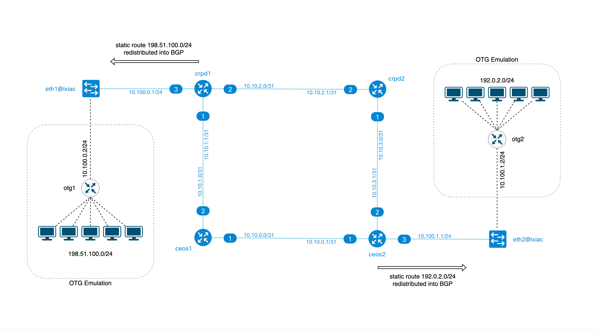

# NANOG-86 Hackathon Open Traffic Generator Lab

## OTG Containerlab topology 

New Containerlab topology file [`nanog_clab_otg_202210.yml`](nanog_clab_otg_202210.yml) has `ixia-c` traffic generator node replacing both `host1` and `host2` nodes from the [original NANOG-86 hackathon setup](nanog_clab_graphite_20221007_2.yaml).

With `ixia-c` node, it becomes possible to introduce emulated network devices and traffic endpoints behind `ixia-c` ports. Such emulation brings more realism to the setup and allows to perform validation of the lab configuration.

For example, we can add an emulated router with a /24 network behind each `ixia-c` port. A diagram of such configuration is shown below. To define such emulated network elements with `ixia-c`, [`otg.yml`](otg.yml) configuration file has to be applied to it. The file follows [Open Traffic Generator](https://otg.dev) specification.



## Deploy a topology

1. Option with Ixia-c replacing `host1` and `host2` with emulated routers (static routing setup)

  ```Shell
  sudo -E clab dep -t nanog_clab_otg_static_202210.yml
  ```

3. Pull MAC addresses from the topology and initialize test parameters

  ```Shell
  curl -s http://localhost:8080/collect/clab/nanog86_otg/nodes/ > node-data.json
  DMAC1=`cat node-data.json | jq -r '.nodes[] | select(.hostname=="crpd1") | .interfaces["eth3"].mac_address'`
  DMAC2=`cat node-data.json | jq -r '.nodes[] | select(.hostname=="ceos2") | .interfaces["Ethernet3"].mac_address'`
  echo $DMAC1 $DMAC2
  rm node-data.json

  OTG_API="https://clab-nanog86_otg-ixiac"
  HOST1=10.100.0.2
  HOST2=10.100.1.2
  GW1=10.100.0.1
  GW2=10.100.1.1

  TESTIP1=198.51.100.1
  TESTIP2=192.0.2.1
  ```

## Run OTG testing


1. Run raw traffic test between `host1` and `host2` IPs - this should work for both topology options

  ```Shell
  otgen create flow --name f1 --dmac $DMAC1 \
                    --src $HOST1 --dst $HOST2 \
                    --txl eth1 --rxl eth2 | \
  otgen add flow --name f2 --dmac $DMAC2 \
                    --src $HOST2 --dst $HOST1 \
                    --txl eth2 --rxl eth1 \
                    --swap | \
  otgen run --insecure --api $OTG_API \
            --metrics flow \
            2>/dev/null |
  otgen transform --metrics flow |
  otgen display --mode table
  ```

2. Run raw traffic test between test IPs - this should work only for option 2

  ```Shell
  otgen create flow --name f1 --dmac $DMAC1 \
                    --src $TESTIP1 --dst $TESTIP2 \
                    --txl eth1 --rxl eth2 | \
  otgen add flow --name f2 --dmac $DMAC2 \
                    --src $TESTIP2 --dst $TESTIP1 \
                    --txl eth2 --rxl eth1 \
                    --swap | \
  otgen run --insecure --api $OTG_API \
            --metrics flow \
            2>/dev/null |
  otgen transform --metrics flow |
  otgen display --mode table
  ```

3. Run traffic test between emulated devices using directly connected IPs - this should work for both topology **options**

  ```Shell
  otgen create device --name otg1 --ip $HOST1 --gw $GW1 --port p1 --location eth1 | \
  otgen add device    --name otg2 --ip $HOST2 --gw $GW2 --port p2 --location eth2 | \
  otgen add flow --name f1 --dmac $DMAC1 \
                    --src $HOST1 --dst $HOST2 \
                    --tx otg1 --rx otg2 | \
  otgen add flow --name f2 --dmac $DMAC2 \
                    --src $HOST2 --dst $HOST1 \
                    --tx otg2 --rx otg1 | \
  otgen run --insecure --api $OTG_API \
            --metrics flow \
            2>/dev/null |
  otgen transform --metrics flow |
  otgen display --mode table
  ```

4. Run traffic test between emulated devices using test IPs - this should work only for option 2

  ```Shell
  otgen create device --name otg1 --ip $HOST1 --gw $GW1 --port p1 --location eth1 | \
  otgen add device    --name otg2 --ip $HOST2 --gw $GW2 --port p2 --location eth2 | \
  otgen add flow --name f1 --dmac $DMAC1 \
                    --src $TESTIP1 --dst $TESTIP2 \
                    --tx otg1 --rx otg2 | \
  otgen add flow --name f2 --dmac $DMAC2 \
                    --src $TESTIP2 --dst $TESTIP1 \
                    --tx otg2 --rx otg1 | \
  otgen run --insecure --api $OTG_API \
            --metrics flow \
            2>/dev/null |
  otgen transform --metrics flow |
  otgen display --mode table
  ```


## Cleanup


1. Destroy option with Ixia-c replacing `host1` and `host2` as is

  ```Shell
  sudo -E clab des -t nanog_clab_otg_202210.yml -c
  ```

2. Destroy option with Ixia-c replacing `host1` and `host2` with emulated routers (static routing setup)

  ```Shell
  sudo -E clab des -t nanog_clab_otg_static_202210.yml -c
  ```

